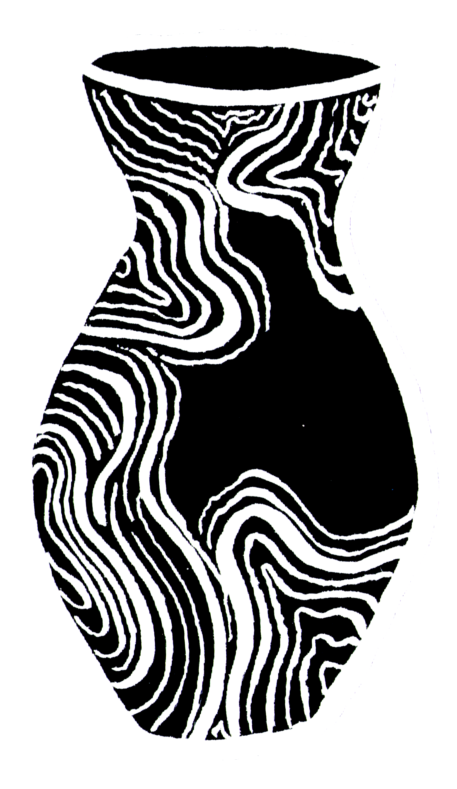
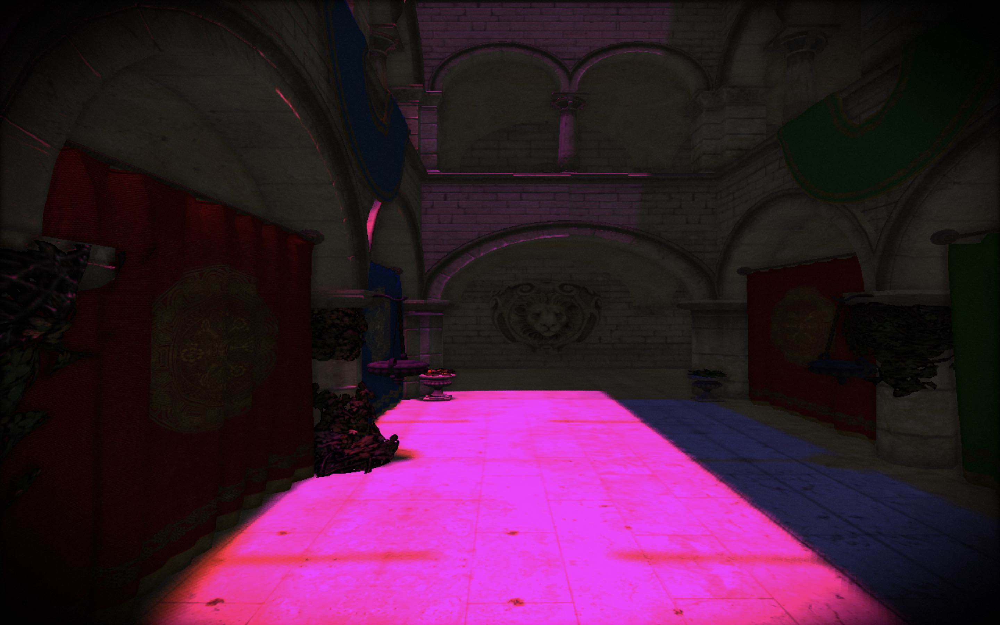
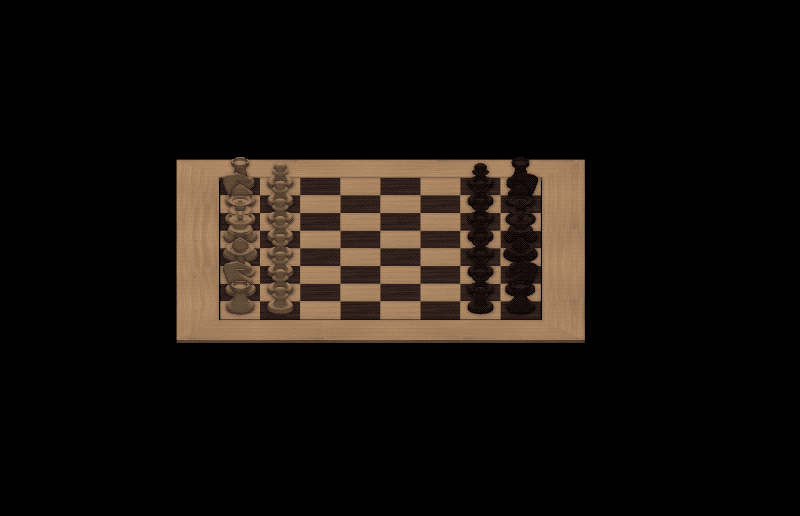

#  Porcelain &middot; 

    

> Prestigious yet delicate
## About

My attempt of creating a 3D Engine suitable for creation of a small game.
Pleace where I can experiment, learn and fail

## Preview

Would you like to see more? Please visit my [devlog](./DEVLOG.md)

    

    

## Example project

A Chess game that features full set of moves for pieces.
Including *el passant*, pawn promotion and castling.
Gameplay is realised through mouse click detection with support of keyboard-triggered camera movement - find it [here](https://github.com/P0rc3lain/Chess)

    

## Documentation

It is limited, yet kept in most recent version and distributed in form of apple's standardized doc.
Helps to understand what structures are used in the project and examine relations between them.
Click [here](https://p0rc3lain.github.io/Engine) to obtain it

## Artifacts

Binaries are built each time a change is pushed to the `main` branch.
Documentation along with the engine framework itself can be found [here](https://github.com/P0rc3lain/Engine/actions/workflows/archive.yml)

## Technology stack

* Swift 5
* Metal 2

## Framework stack

* Combine
* Foundation
* Swift's Standard Library
* Model I/O
* simd
* Metal
* Metal Standard Library

## Capabilites

### Loading

* Integrated with `usdz` format
* Mesh loading from height maps

### Interaction

* Trigger-based automatic refresh of scene node properties:
    * Bounding box
    * Position
* Mouse picking

### Scene management

* Node-based scene graph

### Animation

* Rigid body animation
* Skeletal animation

### Lights

* Point
* Directional
* Spot

### Cameras

* Orthographic
* Perspective

### Effects

* Soft shadow ambient occlusion
* Normal mapping
* Particle effects
* Transparency
* Sky maps
* Multiple resolution support
* Shadows (including PCF support)
    * Point light
    * Spot light
    * Directional light (Dynamically clipped according to camera's position)
* Post processing effects
    * Vignette
    * Bloom
    * Motion blur
    * Film grain
    * Distance fog

### Rendering techniques

* Forward
* Deferred

### Lightning model

* PBR
